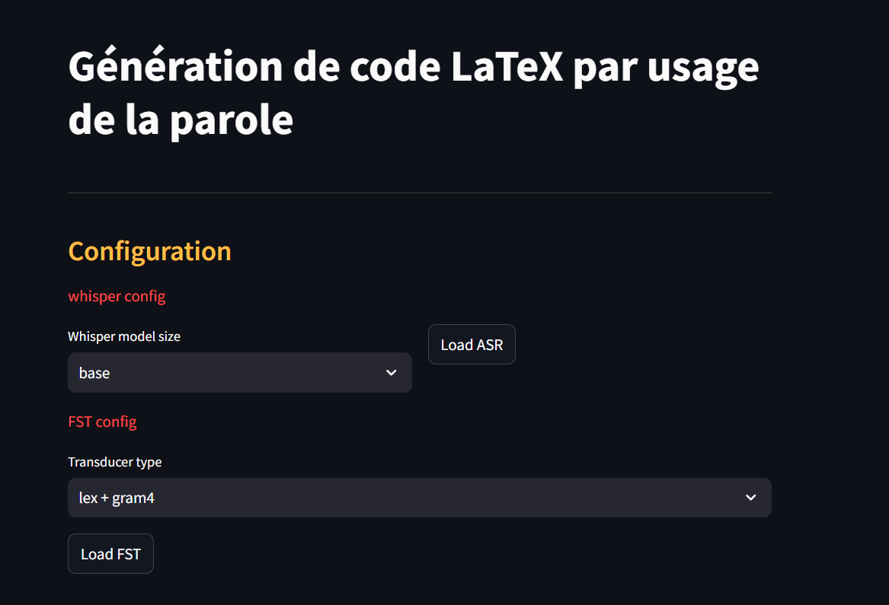
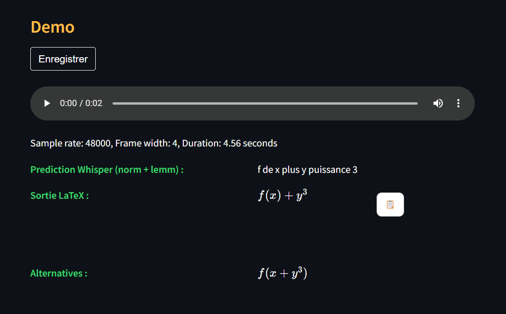

# ASR et transducteurs pour la génération automatique de code LaTeX par la parole

## Intro

Prototype expérimental de génération de code LaTeX par usage de la parole (réalisé en français) composé d'une utilisation hybride d'un grand modèle de reconnaissance de la parole (ASR - Whisper from OpenAI) suivi d'une architecture de transduction à états finis permettant la conversion du langage naturel vers une séquence de code LaTeX. Cela permet au locuteur de pouvoir préserver une locution naturelle pour la dictée d'équations.

## Dépendances

`pip install -r requirements.txt`

## Démo

**Après installation de streamlit, entrer la commande  suivante pour faire tourner l'application localement :**

`streamlit run streamlit_app.py`

**Paramétrer la taille du modèle de reconnaissance de la parole à charger et le type de transducteur :**

**Enregistrer l'équation et observer le résultat de retranscription :**

